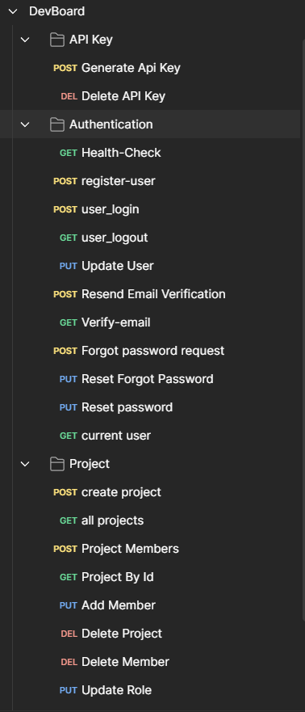

# 🧠 DevBoard – Project Management API

DevBoard is a full-featured backend API for managing users, projects, tasks, roles, and notes — built using **Node.js**, **Express**, and **MongoDB** with secure **JWT authentication** and **role-based access control**.

---

## 🚀 Features

- 🔐 JWT-based authentication with secure cookie support
- ✅ Input validation using **Zod**
- 🛡️ API rate limiting and API keys
- 📂 File uploads with **Multer** + **Cloudinary**
- ✉️ Email support using **Mailtrap** 
- 🗃️ Clean and scalable project/task/note modules
- 📃 Pagination middleware for efficient data fetching
- 👥 Role-based access control with project membership
- 🌍 RESTful API design

---

## 🧾 Project Structure

<pre><code>```bash Backend/ ├── node_modules/ # Installed packages ├── public/temp/ # Temp uploads ├── src/ │ ├── controllers/ # Route logic │ ├── db/ # DB connection │ ├── middlewares/ # Custom middlewares (auth, paginate, multer) │ ├── models/ # Mongoose models │ ├── routes/ # Express route handlers │ ├── Utils/ # Utilities (API response, error, mail, cloudinary) │ ├── Validators/ # Zod validators │ ├── app.js # App configuration │ └── index.js # Server entry point ├── .env # Your secrets (not committed) ├── .env.sample # Sample env for collaborators ├── .gitignore ├── package.json ├── package-lock.json └── README.md ``` </code></pre>


---

## 🔧 Getting Started

### 📦 Prerequisites

- [Node.js](https://nodejs.org/) v18+
- [MongoDB Atlas](https://www.mongodb.com/cloud/atlas)
- Mail service (Mailtrap or Resend)

### 📥 Installation

```bash
# 1. Clone the repo
git clone https://github.com/adii4040/DevBoard-Project-Management-API

# 2. Navigate into project
cd Backend

# 3. Install dependencies
npm install

# 4. Setup environment
cp .env.sample .env
# fill required env values
PORT = 8000
MONGODB_URL=YOUR_MONGODB_URL
CORS_ORIGIN = *
BASE_URL=YOUR_BASE_URL

ACCESS_TOKEN_SECRET_KEY=YOUR_ACCESS_TOKEN_SECRET_KEY
REFRESH_TOKEN_SECRET_KEY=YOUR_REFRESH_TOKEN_SECRET_KEY

# Mailtrap
MAILTRAP_SMTP_HOST=YOUR_MAILTRAP_SMTP_HOST
MAILTRAP_SMTP_PORT=YOUR_MAILTRAP_SMTP_PORT
MAILTRAP_SMTP_USER=YOUR_MAILTRAP_SMTP_USER
MAILTRAP_SMTP_PASS=YOUR_MAILTRAP_SMTP_PASS


# Cloudinary
CLOUDINARY_CLOUD_NAME=YOUR_CLOUDINARY_CLOUD_NAME
CLOUDINARY_API_KEY=YOUR_CLOUDINARY_API_KEY
CLOUDINARY_API_SECRET=YOUR_CLOUDINARY_API_SECRET


# 5. Start the development server
npm run dev
```

## 📬 Postman API Collection

You can test all endpoints using the Postman collection below:

🔗 [→ DevBoard.postman_collection.json](./docs/DevBoard.postman_collection.json)

Make sure to set the following environment variable in Postman:

| Key               | Example Value            |
|------------------|--------------------------|
| `devBoard-server`| `http://localhost:8000/api/v1` |

All request bodies are cleared to just show placeholder fields.

## 📸 Screenshots

### 🔧 API Testing with Postman


## 📘 API Documentation

### 🔐 Authentication Routes
| Method | Endpoint                          | Description             | Auth Required |
| ------ | --------------------------------- | ----------------------- | ------------- |
| POST   | `/api/v1/register-user`           | Register new user       | ❌ No          |
| POST   | `/api/v1/user_login`              | Login user              | ❌ No          |
| GET    | `/api/v1/current-user`            | Get logged-in user data | ✅ Yes         |
| GET    | `/api/v1/verify-email`            | Verify user's email     | ❌ No          |
| POST   | `/api/v1/forgot-password-request` | Request password reset  | ❌ No          |
| PUT    | `/api/v1/reset-password`          | Reset password          | ❌ No          |


### 🧪 API Key Routes
| Method | Endpoint                  | Description      |
| ------ | ------------------------- | ---------------- |
| POST   | `/api/v1/generate-apikey` | Generate API key |
| DELETE | `/api/v1/delete-apikey`   | Delete API key   |

### 📂 Project Routes
| Method | Endpoint                                 | Description                   |
| ------ | ---------------------------------------- | ----------------------------- |
| POST   | `/api/v1/project/create`                 | Create new project            |
| GET    | `/api/v1/project`                        | Get all projects              |
| GET    | `/api/v1/project/:projectId`             | Get project by ID             |
| POST   | `/api/v1/project/:projectId/members`     | Add member to project         |
| DELETE | `/api/v1/project/:projectId/member/:id`  | Remove member from project    |
| PUT    | `/api/v1/project/:projectId/role`        | Update member role            |
| GET    | `/api/v1/project/:projectId/export-json` | Download project data as JSON |

### 📝 Task Routes
| Method | Endpoint                                         | Description                     |
| ------ | ------------------------------------------------ | ------------------------------- |
| POST   | `/api/v1/project/:projectId/task/create-task`    | Create a task                   |
| GET    | `/api/v1/project/:projectId/task`                | Get all tasks (with pagination) |
| GET    | `/api/v1/project/:projectId/task/:taskId`        | Get task by ID                  |
| PUT    | `/api/v1/project/:projectId/task/:taskId/update` | Update task                     |
| DELETE | `/api/v1/project/:projectId/task/:taskId/delete` | Delete task                     |

### 🗒️ Notes Routes
| Method | Endpoint                           | Description         |
| ------ | ---------------------------------- | ------------------- |
| POST   | `/api/v1/project/:projectId/notes` | Create project note |
| GET    | `/api/v1/project/:projectId/notes` | Get all notes       |
| PUT    | `/api/v1/notes/:noteId/update`     | Update note         |
| DELETE | `/api/v1/notes/:noteId/delete`     | Delete note         |

## 🔐 Authorization
All protected routes require:
-   *x-api-key: <API_KEY>*


## 📚 Built With

- [Node.js](https://nodejs.org/)
- [Express.js](https://expressjs.com/)
- [MongoDB + Mongoose](https://mongoosejs.com/)
- [Zod](https://zod.dev/)
- [Multer](https://github.com/expressjs/multer)
- [Cloudinary](https://cloudinary.com/)
- [Nodemailer](https://nodemailer.com/)

## 📄 License

This project is licensed under the [MIT License](LICENSE).


